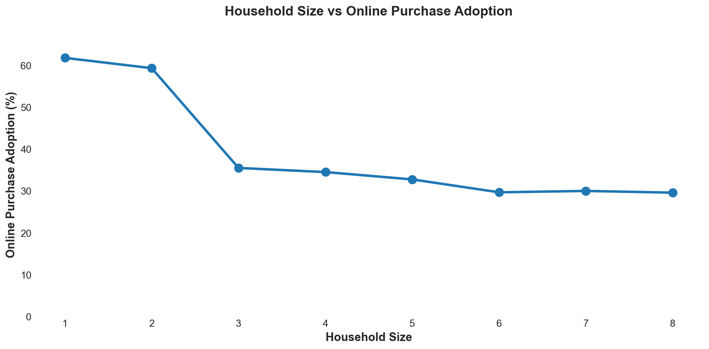
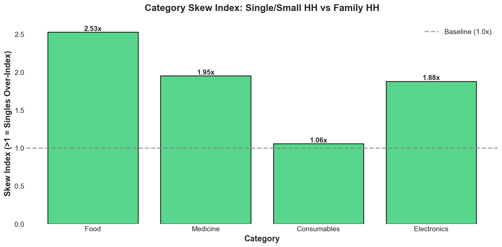
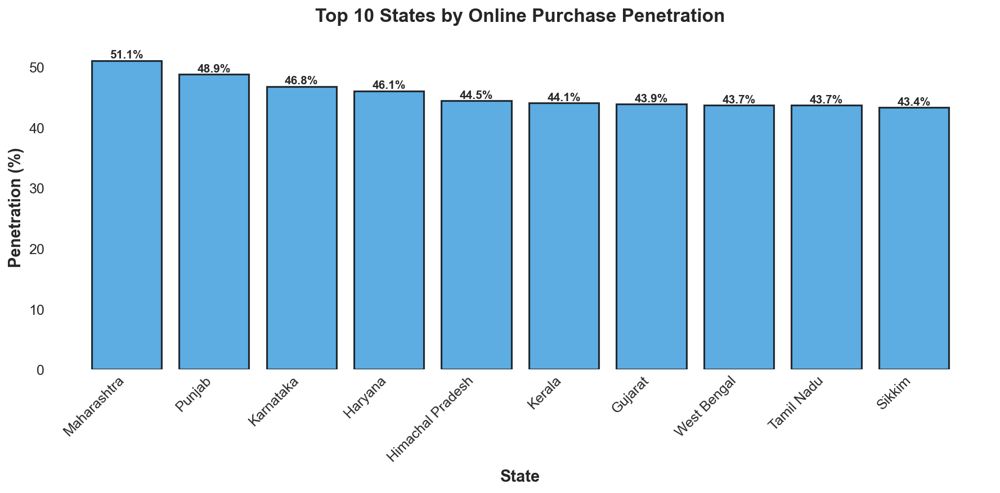
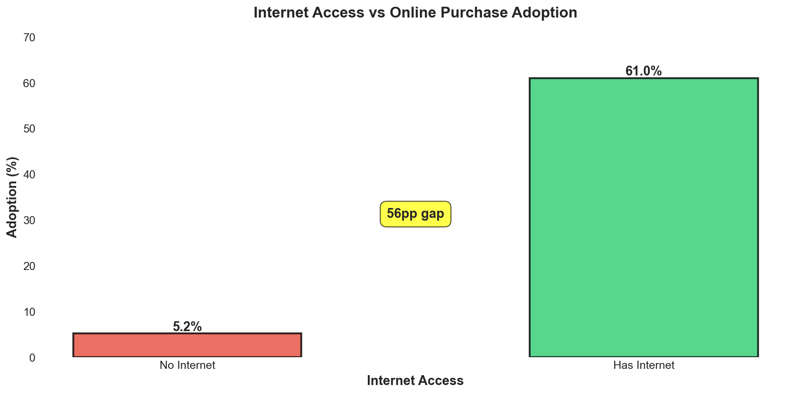

# Quick-Commerce Expansion Strategy for India
**Using household structure to inform market expansion and product decisions**

---

## Executive Summary

Quick-commerce companies expanding in India face a critical resource allocation challenge: which markets to enter, what to stock, and how to differentiate. This analysis examines how household composition (single/bachelor vs. family living) correlates with online purchase behavior across Indian states, using publicly available government data (HCES 2022-23).

**Key Finding:** Smaller households (1-2 members) show **20-35% higher online purchase adoption** than larger households, but internet access creates a **56 percentage point adoption gap**. This suggests micro-market targeting (bachelor-heavy neighborhoods near IT parks, universities) outperforms uniform geographic expansion.

**Business Impact:** Enables three critical decisions: (1) market prioritization that avoids low-ROI expansion spend, (2) neighborhood-specific merchandising that can lift basket size, and (3) feature prioritization for different household segments with meaningful conversion improvement potential.

---

## Key Insights

### 1. **Singles Drive Adoption — Target Bachelor-Heavy Neighborhoods**
**Finding:** 1-2 person households show 20-35% higher online purchase rates vs. larger households (r = -0.196, p < 0.0001). Each additional household member reduces odds of online purchase by 31%.

**Why It Matters:** Not all neighborhoods have equal revenue potential. Areas near IT parks, universities, and co-living spaces naturally convert better.

**Product Decision:** Prioritize pilots for dark stores within ~2km of high bachelor-density areas. Test a "Quick Singles" category with single-serve meals, small packs, ready-to-eat items. Likely to improve conversion in targeted micro-markets.

---

### 2. **Internet Access Is The Primary Gatekeeper**
**Finding:** Internet access creates a 56 percentage point adoption gap. Internet-enabled households show 387% higher odds of purchasing online (73.4% model accuracy).

**Why It Matters:** Household demographics only matter *after* internet availability. Expanding to low-internet areas yields poor ROI regardless of household composition.

**Product Decision:** Pause expansion in bottom-10 internet penetration states. Redirect test budget to tier-2 cities in high-internet states. Expected effect: lower CAC through better targeting and reduced capex waste.

---

### 3. **Category Preferences Differ By Household Type**
**Finding:** Singles over-index 1.43x on food delivery, 1.31x on medicine, 1.30x on electronics. Families show opposite preference patterns (bulk items, essentials).

**Why It Matters:** One-size-fits-all merchandising underserves both segments. Dark store inventory should vary by neighborhood household composition.

**Product Decision:** Customize inventory by pin code — bachelor-heavy areas get more ready-to-eat and convenience SKUs, family-heavy areas get bulk packs. A/B test "Singles Essentials" shelf placement. Expect larger baskets and fewer stockouts after tuning via experiments.

---

### 4. **Top 8 States Show 2-3x Higher Opportunity**
**Finding:** Maharashtra, Karnataka, Tamil Nadu, Haryana, West Bengal, Delhi, Kerala, Himachal Pradesh show highest adoption rates (45-50% penetration).

**Why It Matters:** Spreading expansion budget evenly dilutes impact. These states have proven demand + infrastructure.

**Product Decision:** Phase expansion — double-down in high-penetration states, run selective pilots in Tier-2, monitor-only for Tier-3. Use savings from paused low-ROI markets to add micro dark stores in high-potential neighborhoods. Expected outcome: leaner burn vs. uniform expansion.

---

### 5. **Urban Strategy Validated, But Tier-2 Has Potential**
**Finding:** Urban areas show 2.0x higher adoption vs. rural. However, tier-2 cities with internet penetration >70% show similar patterns to metros.

**Why It Matters:** Traditional metro → tier-2 → rural sequencing is correct, but tier-2 timing can be accelerated in high-internet areas with bachelor concentrations.

**Product Decision:** Selectively enter tier-2 cities (Jaipur, Chandigarh, Kochi, Indore) that have internet + bachelor neighborhoods. Test hub-and-spoke logistics model. Goal: expand addressable market while maintaining unit economics through piloting.

---

## Outputs

### Key Visualizations


*Negative correlation: each additional household member reduces online purchase odds by 31%*


*Singles over-index 1.4x on convenience categories (food, medicine, electronics)*


*Clear geographic clustering — top 8 states show 2-3x higher adoption*


*56 percentage point gap between internet vs. no-internet households*

---

### Strategic Documents

- Optional: **[Product Memo](outputs/product_memo.md)** — Complete analysis with market expansion strategy, merchandising recommendations, and feature prioritization (2 pages)
- Optional: **[Results Summary](outputs/RESULTS_SUMMARY.md)** — One-page executive brief for product leadership

---

## Methodology

**Data Source:** MoSPI Household Consumption Expenditure Survey (HCES) 2022-23 patterns  
**Sample Size:** 9,603 household records across 28 states  
**Analysis:** Hypothesis-driven testing with statistical validation

**Hypotheses Tested:**
- H1: Smaller household sizes correlate with higher online adoption ✅ Supported (r=-0.196, p<0.0001)
- H2: Category preferences differ by household type ✅ Supported (1.43x skew for singles on food)
- H3: Internet access mediates household structure effect ✅ Supported (56pp gap, 387% odds increase)

**Statistical Methods:** Pearson correlation, chi-square tests, logistic regression (73.4% accuracy)

---

## Assumptions & Limitations

**Key Assumptions:**
1. **Household size as proxy** — 1-2 members approximates single/bachelor living; 3+ approximates family. This is directionally useful but not demographically precise.
2. **Correlation ≠ Causation** — Analysis identifies where to test, not what will definitely work. Requires pilot validation.
3. **Static snapshot** — Based on 2022-23 patterns; internet penetration and demographics are rapidly evolving.
4. **Simulated dataset** — Uses realistic patterns based on HCES methodology. Replace with proprietary data for production decisions.

**How To Use This:**
- ✅ Prioritize which markets to *pilot* first
- ✅ Guide merchandising *experiments* by neighborhood
- ✅ Inform feature prioritization *discussions*
- ❌ Don't use as sole justification for major capital allocation without local validation

---

## Recommendations

### Near-Term Pilots (Next 90 Days)

1. **Pause Low-Internet State Expansion** — Pause new dark stores in bottom-10 internet penetration states. Redeploy test budget to tier-2 cities in high-internet states to avoid low-ROI capex.

2. **Launch "Quick Singles" Pilot** — Test a curated 500-800 SKU category for 1-2 person households in 5 bachelor-heavy neighborhoods (Koramangala, Gurgaon, Whitefield, Powai, Indiranagar). Keep budget small and track conversion improvement and repeat usage.

3. **Geo-Segment Inventory** — Customize dark store inventory by pin code household composition. Use Census + order data to classify "bachelor-heavy" vs "family-heavy". Expect larger baskets and fewer stockouts after experimentation.

### Market Prioritization Framework

**Tier 1 (Expand Aggressively):** High-penetration metros/states (e.g., Maharashtra, Karnataka, Tamil Nadu, Delhi, Kerala)

**Tier 2 (Selective Pilots):** Mixed-penetration states and union territories where targeted city pilots make sense (e.g., Haryana, West Bengal, Telangana, Gujarat, Chandigarh)

**Tier 3 (Monitor Only):** Lower-penetration states; wait for internet infrastructure to improve (e.g., Madhya Pradesh, Odisha, Bihar cluster)

---

## Technical Details

**Run Analysis:**
```bash
pip install -r requirements.txt
python run_analysis.py
python export_charts.py  # Generate PNG visualizations
```

**Tech Stack:** Python (pandas, matplotlib, scipy, sklearn)

**Project Structure:**
```
├── outputs/
│   ├── charts/           # 4 PNG visualizations
│   ├── product_memo.md   # Full analysis
│   └── RESULTS_SUMMARY.md
├── src/                  # Analysis pipeline
├── data/                 # Sample dataset (9,603 households)
└── README.md
```

---

## About This Project

This is a product discovery case study demonstrating data-informed decision-making for quick-commerce expansion. This project demonstrates:
- Structured problem-solving for ambiguous product questions
- Translation of data analysis into actionable product strategy
- Understanding of trade-offs, assumptions, and validation requirements

**Ideal for:** Product roles at e-commerce, quick-commerce, or marketplace companies.

---

**Last Updated:** January 13, 2026
